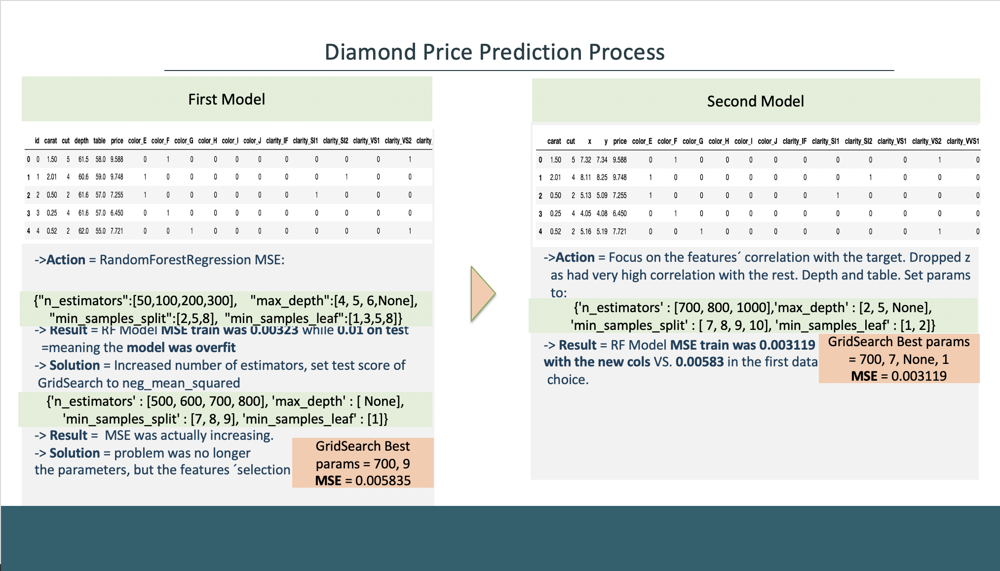

# kaggle-competition-price-prediction

## Goals:
The last Ironhack project consisted on a Kaggle competition between all of us. The mission was to find the best model in the prediction of diamond prices. The dataset had nine features determining the price of diamonds.
We were given two datasets: one for training the model and the second to test it. 

## Procedure:
With a bird´s eye, I analysed the behavior of the data following my cleaning choice.  I converted categorical variables to ordinal. 

On my first analysis, I spotted highly correlated variables that could then be dropped. 

On my second analysis, I figured out that lower MSE was more a result of a right hyperparameter tuning, than of feature selection. 

I have made use of Linear Regressions and Random Forests, but mainly of the latter as it was without doubts the most convenient. 

## Libraries used: 
Sklearn, Pandas, Numpy, Matplotlib, Seaborn

### Project summary:

